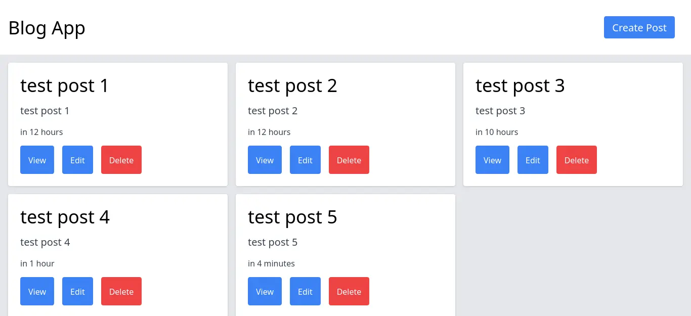

# Blog post management with MERN stack

Simple blog post management system using the MERN stack. The application should allow users to perform basic CRUD operations (Create, Read, Update, Delete) on blog posts.

This is Take-home assignment for MERN stack developer role.

# Demo

[Visit](https://tha-blog-management.vercel.app/)

## Screenshots



## Run Locally

Clone project on your machine

Setup frontend

```sh
cd tha-blog-management/frontend
npm install
```

Start the client
```sh
npm run dev
```

Setup backend

```sh
cd tha-blog-management/backend
npm install
```

Start the server
```sh
npm run dev
```

Visit client URI on browser

## Environment Variables

To run this project, you will need to add environment variables to your `.env` file

See `.env.sample`

## API Reference

Import collection from `tha-blog-management_API_Collection.json` if using Thunder Client VS Code extension

#### Get all Posts

```http
  GET /api/all
```

#### Get Post by ID

```http
  GET /api/:id
```

| Parameter | Type     | Description                |
| :-------- | :------- | :------------------------- |
| `id` | `string` | **Required**. |

#### Update Post by ID

```http
  PUT /api/:id
```

| Parameter | Type     | Description                |
| :-------- | :------- | :------------------------- |
| `id` | `string` | **Required**. |
| `title` | `string` | **Required**. |
| `content` | `string` | **Required**. |

#### Delete Post by ID

```http
  DELETE /api/:id
```

| Parameter | Type     | Description                |
| :-------- | :------- | :------------------------- |
| `id` | `string` | **Required**. |

#### Create Post

```http
  POST /api/create
```

| Parameter | Type     | Description                |
| :-------- | :------- | :------------------------- |
| `title` | `string` | **Required**. |
| `content` | `string` | **Required**. |

## License

[MIT](https://choosealicense.com/licenses/mit/)
